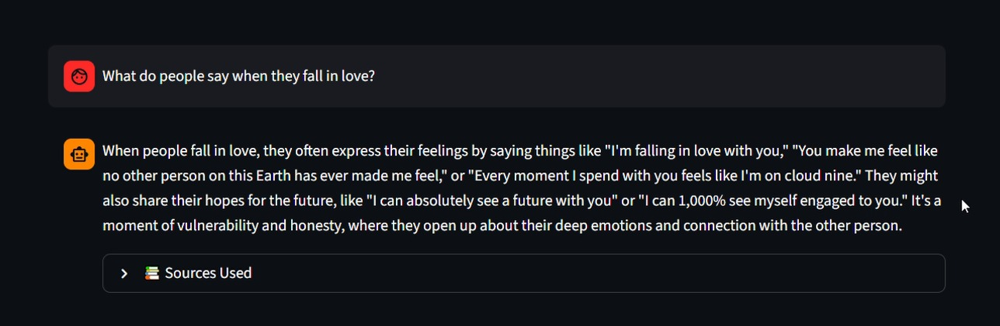
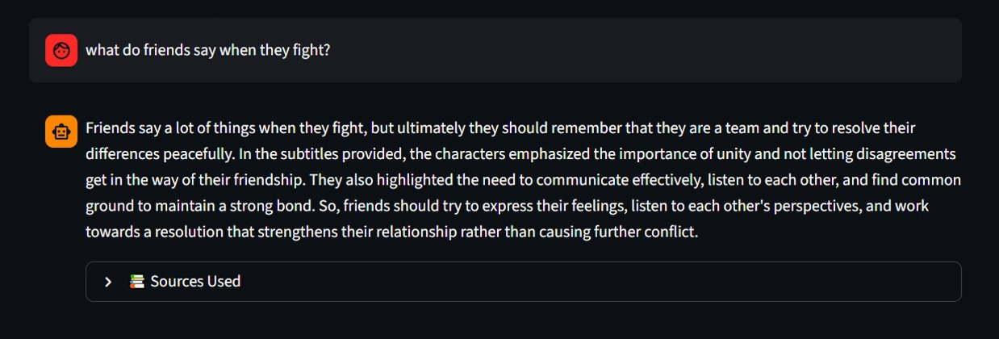

# 🎬 CineSearch — AI Powered Subtitle Search Chatbot

An end-to-end RAG (Retrieval Augmented Generation) pipeline that enables
intelligent semantic search and conversational Q&A across 22,000+ movie
and TV show subtitles spanning 1990–2024.



---

## 🏗️ Architecture

```
1.8GB Subtitle Database (82,000+ files)
              ↓
Custom NLP Cleaning Pipeline
              ↓
Document Chunking (500 words, 50 overlap)
              ↓
BERT Embeddings (all-MiniLM-L6-v2)
              ↓
FAISS Vector Store
              ↓
User Query → Semantic Search → GPT-3.5 Answer
              ↓
Streamlit Chatbot UI
```

---

## 🛠️ Tech Stack

| Component | Technology |
|---|---|
| Language | Python |
| Embeddings | BERT (SentenceTransformers all-MiniLM-L6-v2) |
| Vector Database | FAISS (Facebook AI Similarity Search) |
| LLM | OpenAI GPT-3.5-turbo |
| Framework | LangChain |
| Frontend | Streamlit |
| Data Processing | Pandas, NumPy, Regex |

---

## ✨ Features

- 🔍 Semantic search across 22,000+ subtitle files
- 🤖 Conversational Q&A powered by OpenAI GPT-3.5
- 📺 Returns results from real movies and TV shows
- 📄 Shows source references for every answer
- 💬 Chat history maintained within session
- ⚡ Sub-second FAISS vector search

---

## 📊 Project Scale

| Metric | Value |
|---|---|
| Raw database size | 1.8 GB |
| Total subtitle files | 82,000+ |
| Files processed (30%) | 22,733 |
| Total chunks created | 232,536 |
| BERT embeddings generated | 58,134 |
| Embedding dimensions | 384 |
| Years covered | 1990 – 2024 |

---

## 🚀 How to Run

```bash
# Clone the repository
git clone https://github.com/roshan7108/cinesearch-subtitle-chatbot.git
cd cinesearch-subtitle-chatbot

# Create virtual environment
python -m venv venv
venv\Scripts\activate  # Windows
source venv/bin/activate  # Mac/Linux

# Install dependencies
pip install -r requirements.txt

# Add your OpenAI API key
# Create .env file and add:
# OPENAI_API_KEY=your_key_here

# Run the app
streamlit run app.py
```

---

## 💡 Sample Questions to Try

- *"What happens when someone falls in love?"*
- *"Tell me about a murder investigation scene"*
- *"What do friends say when they fight?"*
- *"What do coaches say to motivate their team?"*
- *"Tell me something funny from a comedy show"*

---

## 📸 Demo


---

## 🧠 Key Learning

This project demonstrates the real difference between:

**Keyword Search** — finds exact word matches
**Semantic Search** — understands meaning and context

BERT embeddings capture semantic meaning so a query like
*"I love you"* returns results about romance, relationships
and emotional connections — not just exact phrase matches!

---

## 👤 Built By

**Roshan Kumar**
- 📧 70roshan81@gmail.com
- 💼 [LinkedIn](https://www.linkedin.com/in/roshan-kumar-21596b208/)
- 🐙 [GitHub](https://github.com/roshan7108)
